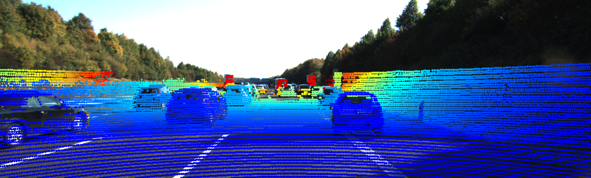

# LiDAR Bike

## Intro

[Description](<[https://www.cnblogs.com/azureology/p/14004131.html](https://github.com/ftlll/LiDAR_Bike/blob/main/Assessment.pdf)>)

## Dependices

```
conda create -n LiDAR python=3.8
conda activate LiDAR

pip install opencv-python
```

## Usage

copy app.py to the root foldler with given sensors data and run

```
python3 app.py
```

API will be available at http://localhost:3000/sync_data for question 3 and http://localhost:3000/bonus for bonus

## Bonus output


